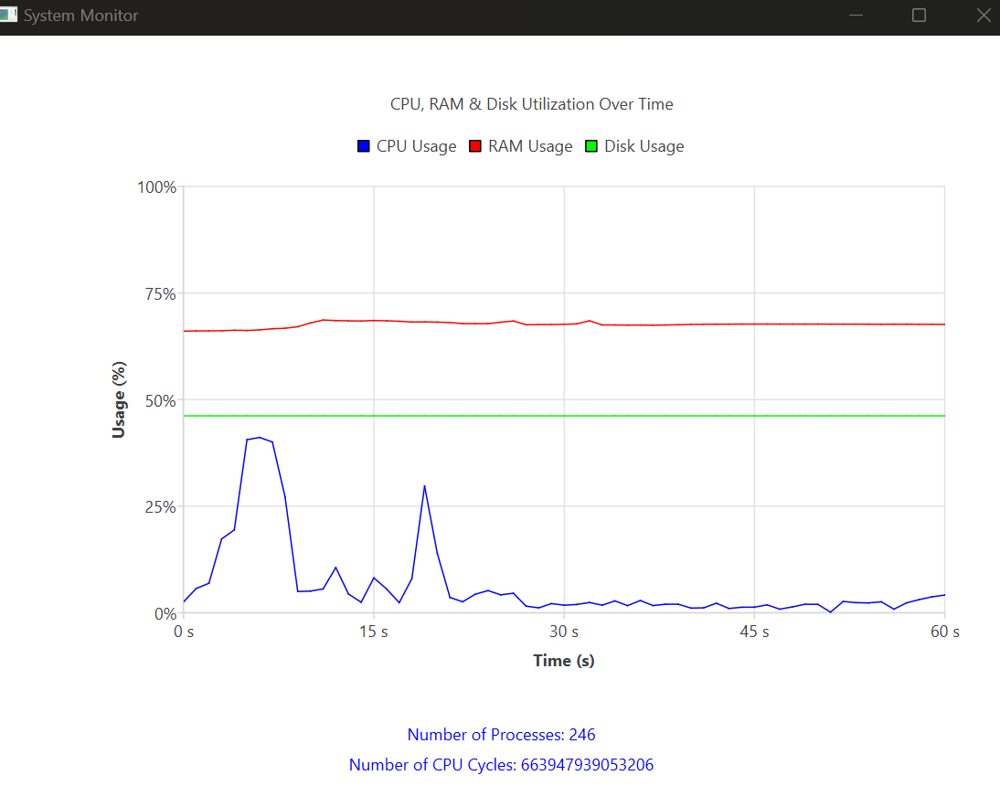

# System Monitor Application

## Overview

This project is a System Monitor Application that tracks and displays various metrics such as CPU usage, RAM usage, Disk Space usage, number of processes, and CPU cycles. The application is built using Qt for the graphical user interface and QtCharts for real-time data visualization.
